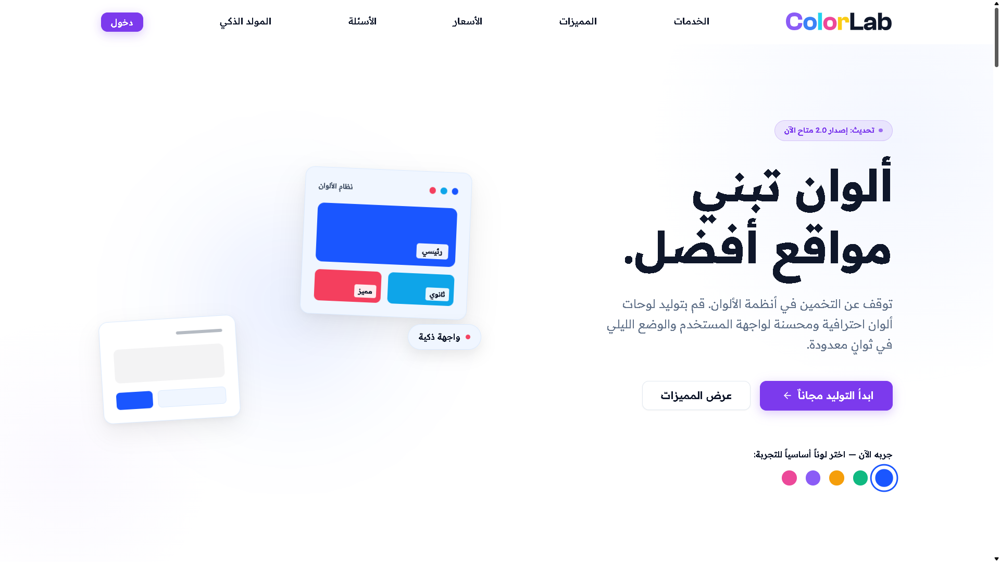
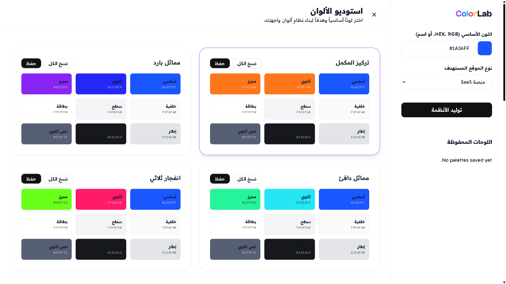

<h1 align="center">ColorLab</h1>

<p align="center">
  AI-powered color system generator — build professional UI palettes in seconds.
</p>

<p align="center">
  <a href="https://colorlab811.vercel.app/" target="_blank">
    
  </a>
</p>

---

## Preview

<table>
  <tr>
    <td></td>
    <td></td>
  </tr>
  <tr>
    <td align="center">Hero Page</td>
    <td align="center">Color Studio</td>
  </tr>
</table>

---

## Features

- **AI Color Generation** — Generate complete UI color systems from a single base color
- **Multiple Harmony Modes** — Complementary, triadic, analogous, and split-complementary palettes
- **Dark Mode Ready** — Every palette is optimized for both light and dark interfaces
- **SaaS-Focused Output** — Palettes tailored for landing pages, dashboards, and product UIs
- **One-Click Copy** — Copy HEX, RGB, or CSS variables instantly
- **Saved Palettes** — Bookmark and revisit your favorite color systems

---

## Tech Stack

| Layer       | Technology              |
|-------------|-------------------------|
| Frontend    | HTML, CSS, JavaScript   |
| AI / Logic  | Custom color algorithm  |
| Deployment  | Vercel                  |
| Typography  | Google Fonts            |

---

## Project Structure

```
colorLab/
├── index.html          # Landing page
├── studio.html         # Color studio / generator
├── assets/
│   ├── css/            # Stylesheets
│   └── js/             # Application logic
├── preview-1.png
└── preview-2.png
```

---

## Getting Started

```bash
# Clone the repository
git clone https://github.com/yasser8111/colorlab.git

# Open in browser
open index.html
```

---

<p align="center">
  Built by <a href="https://github.com/yasser8111">Yasser</a> — 2025
</p>
